# Computer Architecture Exam Notes

---

## 📚 TABLE OF CONTENTS
1. [Multiple Choice Questions](#mcq)
2. [True/False Questions](#truefalse)
3. [True/False with Corrections](#tfcorrect)
4. [Definition Questions](#definitions)
5. [Fill in the Blanks](#fillblanks)
6. [Short Answer Questions](#shortanswer)
7. [Calculation Problems](#calculations)
8. [Formula Reference Sheet](#formulas)

---

<a name="mcq"></a>
## SECTION 1: MULTIPLE CHOICE QUESTIONS

### Q1. The mechanical computer that included mechanisms that provided memory and an arithmetic processing unit was the:
**Answer: B) Difference Engine**

---

### Q2. The first general-purpose programmable electronic computer was the:
**Answer: A) ENIAC**

**OR (Alternative Version):**

### Q2. Many desktop computers utilize the ___ bus standard in which the system augments its main bus with dedicated I/O buses using expansion slots.
**Answer: D) peripheral component interconnect (PCI)**

---

### Q3. System with 32-bit memory words, built from 16 1M×16 RAM chips. Memory size in words?
**Answer: A) 8M**

**Formula:**
```
Total bits = 16 chips × 1M × 16 bits = 256M bits
Words = 256M bits / 32 bits per word = 8M words
```

---

### Q4. System with 32-bit memory words, built from 16 1M×8 RAM chips. Address bits required?
**Answer: C) 24**

**Formula:**
```
Total bytes = 16 × 1M = 16M bytes
Address bits = log₂(16M) = log₂(2²⁴) = 24 bits
```

**OR (Alternative Version):**

### Q4. System has byte-addressable memory size of 4GB. How many bits required for each address?
**Answer: C) 32**

**Formula:**
```
4GB = 2³² bytes
Address bits = log₂(2³²) = 32 bits
```

---

### Q5. 1024-word memory, 16-way low-order interleaved. Size of offset field?
**Answer: D) 4 bits**

**Formula:**
```
Offset bits = log₂(16) = 4 bits
```

---

### Q6. A "store" statement is an example of:
**Answer: A) a data movement instruction**

---

### Q7. Postfix notation: 10 5 + 6 3 - / ≡ Infix?
**Answer: A) (10+5)/(6-3)**

**Stack Evaluation:**
```
10 5 + → 15
6 3 - → 3  
15 3 / → 5
Result: (10+5)/(6-3)
```

**OR (Alternative Version):**

### Q7. Examples of hazards in pipelines include:
**Answer: A) resource conflicts, data dependencies, and conditional branch statements**

---

### Q8. A "subtract" statement is an example of:
**Answer: B) an arithmetic instruction**

**OR (Alternative Version):**

### Q8. Fixed-length instructions:
**Answer: A) waste space but are fast and perform better than variable length instructions**

---

### Q9. Using combination of memory types for best performance at best cost:
**Answer: B) hierarchical memory**

---

### Q10. "Locality of reference" refers to:
**Answer: C) clustering of memory references**

**OR (Alternative Version):**

### Q10. If cache access requires one clock cycle and dealing with cache misses requires an additional five clock cycles, which cache hit rate results in effective access time of 2 clock cycles?
**Answer: B) 80%**

**Formula:**
```
EAT = HR × 1 + (1-HR) × 6 = 2
HR + 6 - 6HR = 2
-5HR = -4
HR = 0.8 = 80%
```

---

### Q11. All are cache replacement algorithms EXCEPT:
**Answer: D) thrashing**

---

### Q12. Disk and tape are forms of ___ storage:
**Answer: B) sequential**

**OR (Alternative Version):**

### Q12. A major advantage of direct mapped cache is its simplicity and ease of implementation. The main disadvantage is:
**Answer: C) its performance is degraded if two or more blocks that map to the same location are used alternately**

---

### Q13. Memory-mapped I/O: I/O devices and main memory share:
**Answer: B) same address space**

**OR (Alternative Version):**

### Q13. Assuming an 8-bit virtual address with pages of 32 bytes, the virtual address format is:
**Answer: B) 3 bits for the page and 5 bits for the offset**

**Formula:**
```
Offset = log₂(32) = 5 bits
Page = 8 - 5 = 3 bits
```

---

### Q14. Engineers describe bus operation through pictures known as:
**Answer: A) timing diagrams**

---

### Q15. SIMD means:
**Answer: C) single instruction stream, multiple data streams**

**OR (Alternative Version):**

### Q15. If a system's instruction set consists of an 8-bit opcode, what is the maximum number of output signal lines required for the control unit?
**Answer: D) 256**

**Formula:**
```
Maximum signals = 2⁸ = 256
```

---

<a name="truefalse"></a>
## SECTION 2: TRUE/FALSE QUESTIONS

| # | Statement | Answer |
|---|-----------|--------|
| 1 | RAID DP can tolerate simultaneous loss of two disk drives | **T** |
| 2 | Ballistic tables were produced by ENIAC during WWII | **F** |
| 3 | Cloud computing ≠ classical distributed computing in all concepts | **T** |
| 4 | Biological computing uses living organism components | **T** |
| 5 | Interrupt checking done at various times during instruction execution | **T** |
| 6 | Thread shares code/data but has own stack and IP | **T** |
| 7 | Short instructions better: less room, fetch quickly | **T** |
| 8 | VLIW relies entirely on compiler not hardware | **T** |
| 9 | Fixed-length instructions have same number of operands | **F** |
| 10 | Little endian: LSB at lower address | **T** |
| 11 | Big endian: LSB at lower address | **F** |
| 12 | Human languages analogy to RISC/CISC | **T** |
| 13 | RAID-1 = disk mirroring | **T** |
| 14 | Hologram = 3D image by laser manipulation | **T** |
| 15 | Memristor = volatile RAM | **F** |

**Additional T/F Questions:**

| # | Statement | Answer |
|---|-----------|--------|
| 1 | Ballistic tables were produced by ENIAC during WWII | **F** |
| 2 | Short instructions better: less room, fetch quickly | **T** |
| 3 | Fixed-length instructions always have same number of operands | **F** |
| 4 | Big endian: LSB at lower address | **F** |
| 5 | Important to know if computer is byte/word addressable for cache mapping | **T** |
| 6 | All cache mapping schemes require offset field | **T** |
| 7 | Fixed-length instruction must have fixed-length opcodes | **F** |
| 8 | VLIW: each instruction can specify multiple scalar operations | **T** |
| 9 | Assembler assembles assembly into RTL | **F** |
| 10 | Control store for hardwired control unit uses ROM/EPROM/PROM | **F** |

---

<a name="tfcorrect"></a>
## SECTION 3: TRUE/FALSE WITH CORRECTIONS

**Instructions:** Identify if statement is legal/correct. If not, correct it.

### Q1. IR ← MAR (for MARIE datapath)
**Answer: NOT LEGAL**

**Correction:**
```
MAR ← IR
(IR cannot be destination in MARIE)
```

---

### Q2. MBR ← AC (for MARIE datapath)
**Answer: LEGAL** ✓

---

### Q3. AC ← AC + MBR (for MARIE datapath)
**Answer: LEGAL** ✓

---

### Q4. Not all cache mapping schemes require a main memory address to have an offset field.
**Answer: FALSE**

**Correction:**
```
All cache mapping schemes require an offset field.
The offset field identifies the byte within a cache block.
```

---

### Q5. One disadvantage to big endian representation is that most computers require words to be written on word address boundaries.
**Answer: FALSE**

**Correction:**
```
This is not specific to big endian representation.
Word alignment requirements apply to both big endian and little endian systems.
```

---

<a name="definitions"></a>
## SECTION 4: DEFINITIONS

### 1. DRAM (Dynamic Random Access Memory)
- Volatile memory storing each bit in a capacitor
- Requires periodic refresh (every few milliseconds)
- Cheaper but slower than SRAM
- Used for main system memory

### 2. RISC (Reduced Instruction Set Computer)
- Simple, uniform instructions (typically 32-bit fixed length)
- Most instructions execute in one clock cycle
- Load/store architecture (only load/store access memory)
- Large register set, compiler optimization
- Examples: ARM, MIPS, RISC-V

### 3. RAM (Random Access Memory)
- Volatile primary memory
- Equal access time to any location
- Used for data and programs during execution
- Types: SRAM (fast, expensive) and DRAM (slow, cheap)

### 4. Effective Access Time (EAT)
- Average memory access time accounting for cache hits/misses
- **Formula:** EAT = (Hit Rate × Cache Time) + (Miss Rate × Miss Penalty)
- Lower EAT = better performance

### 5. Expanding Opcode
- Variable-length opcode encoding scheme
- Shorter opcodes for frequent instructions (more operand bits)
- Longer opcodes for rare instructions (fewer operand bits)
- Maximizes instruction variety within fixed instruction width

---

<a name="fillblanks"></a>
## SECTION 5: FILL IN THE BLANKS

### 1. Von Neumann CPU Components
**Answers:** 
- **ALU** (Arithmetic Logic Unit)
- **Control Unit**
- **Registers**
- Program Counter

---

### 2. Three Main Cache Mapping Schemes
**Answers:**
- **Direct mapped**
- **Fully associative**
- **Set associative**

---

### 3. Cache vs Memory Access
**Answers:**
- Cache accessed by: **tag**
- Main memory accessed by: **address**

---

### 4. Computer Bus Components
**Answers:**
- A computer bus consists of: data lines, power lines, **address lines**, and **control lines**

---

### 5. General-Purpose Architectures Groups
**Answers:**
- Memory-memory, **register-memory**, **register-register**

---

### 6. Cache Memory Position
**Answer:**
- Cache memory is typically positioned between the CPU and **main memory**

---

### 7. Three Basic ISA Architectures
**Answers:**
- **Stack**
- **Accumulator**
- General-purpose registers

---

### 8. Flynn's Taxonomy Factors
**Answers:**
- Number of **instruction streams**
- Number of **data streams**

---

<a name="shortanswer"></a>
## SECTION 6: SHORT ANSWER QUESTIONS

### Question 1: Endianness Storage
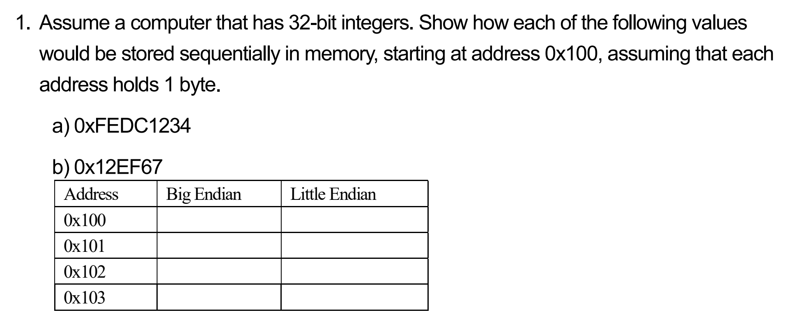

**a) Store 0xFEDC1234 starting at 0x100**

| Address | Big Endian | Little Endian |
|---------|------------|---------------|
| 0x100   | FE         | 34            |
| 0x101   | DC         | 12            |
| 0x102   | 12         | DC            |
| 0x103   | 34         | FE            |

**b) Store 0x12EF67 (24-bit value)**

| Address | Big Endian | Little Endian |
|---------|------------|---------------|
| 0x100   | 00         | 67            |
| 0x101   | 12         | EF            |
| 0x102   | EF         | 12            |
| 0x103   | 67         | 00            |

---

### Question 2: Reverse Polish Notation to Infix

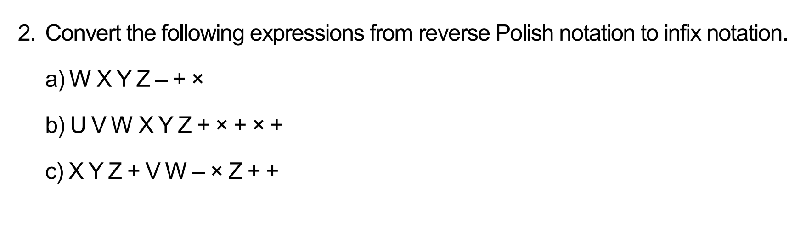

**a) W X Y Z – + ×**

**Stack Process:**
```
[W] → [W,X] → [W,X,Y] → [W,X,Y,Z]
– → [W,X,(Y-Z)]
+ → [W,(X+(Y-Z))]
× → [W×(X+(Y-Z))]
```
**Answer: W × (X + (Y - Z))**

---

**b) U V W X Y Z + × + × +**

**Answer: U + (V × (W + (X × (Y + Z))))**

---

**c) X Y Z + V W – × Z + +**

**Answer: X + ((Y + Z) × (V - W)) + Z**

---

### Question 3: Addressing Modes - Load 1000

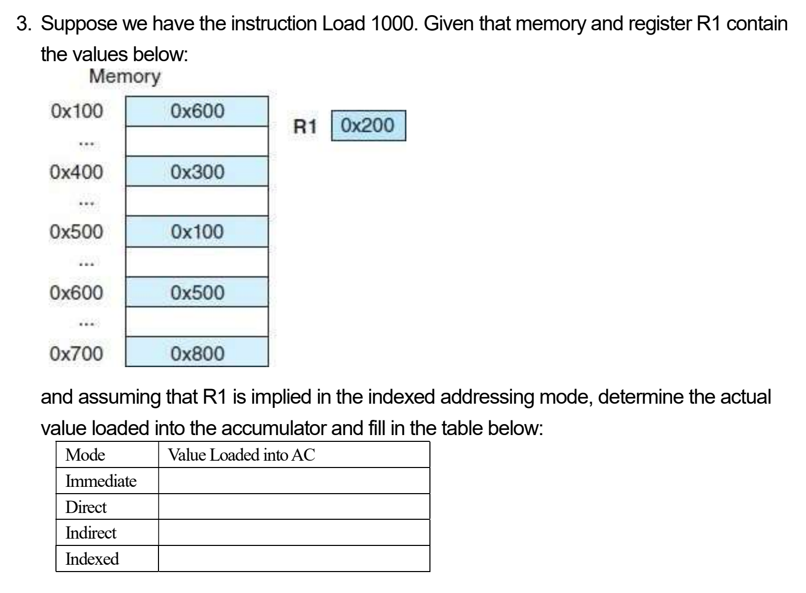

**Given:** Memory[1000]=600, Memory[600]=800, R1=200

| Mode | Value Loaded into AC |
|------|----------------------|
| Immediate | 1000 |
| Direct | 600 |
| Indirect | 800 |
| Indexed | Memory[1200] = 1000 |

---

### Question 3 (Alternative): Addressing Modes - Load 600

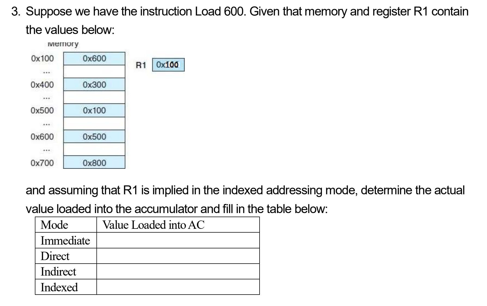

**Given:** Memory[600]=500, Memory[500]=300, R1=100

| Mode | Value Loaded into AC |
|------|----------------------|
| Immediate | 600 |
| Direct | 500 |
| Indirect | 300 |
| Indexed | Memory[700] = 800 |

---

### Question 4: Fully Associative Cache

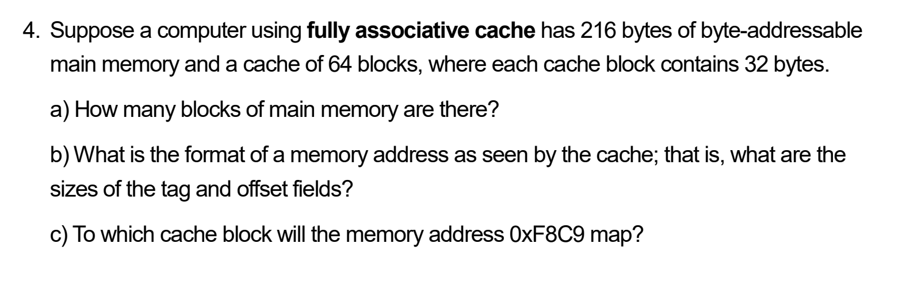

**Given:** Memory=2¹⁶ bytes, Cache=64 blocks, Block size=32 bytes

**a) Main memory blocks:**
```
Number = 2¹⁶ / 32 = 2048 blocks
```

**b) Address format:**
```
Offset = log₂(32) = 5 bits
Tag = 16 - 5 = 11 bits
Format: [11-bit Tag | 5-bit Offset]
```

**c) Address 0xF8C9 maps to:**
```
Any cache block (fully associative)
Tag = 0x7C6, Offset = 0x09
```

---

### Question 4 (Alternative): Instruction Format

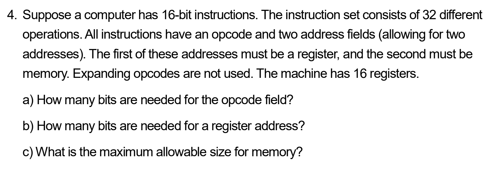

**Given:** 16-bit instructions, 32 operations, 16 registers
- First address: register
- Second address: memory

**a) Opcode bits:**
```
log₂(32) = 5 bits
```

**b) Register address bits:**
```
log₂(16) = 4 bits
```

**c) Maximum memory size:**
```
Remaining bits = 16 - 5 - 4 = 7 bits
Memory size = 2⁷ = 128 words
```

---

### Question 5: Disk Drive Characteristics

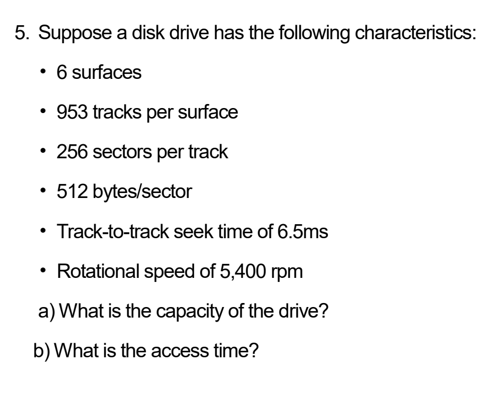

**Given:** 6 surfaces, 953 tracks/surface, 256 sectors/track, 512 bytes/sector, 6.5ms seek, 5400 rpm

**a) Capacity:**
```
6 × 953 × 256 × 512 = 752,025,600 bytes ≈ 717 MB
```

**b) Access time:**
```
Seek = 6.5 ms
Rotational latency = (60/5400)/2 × 1000 = 5.56 ms
Total ≈ 12 ms
```

---

### Question 5 (Alternative): MARIE Instructions

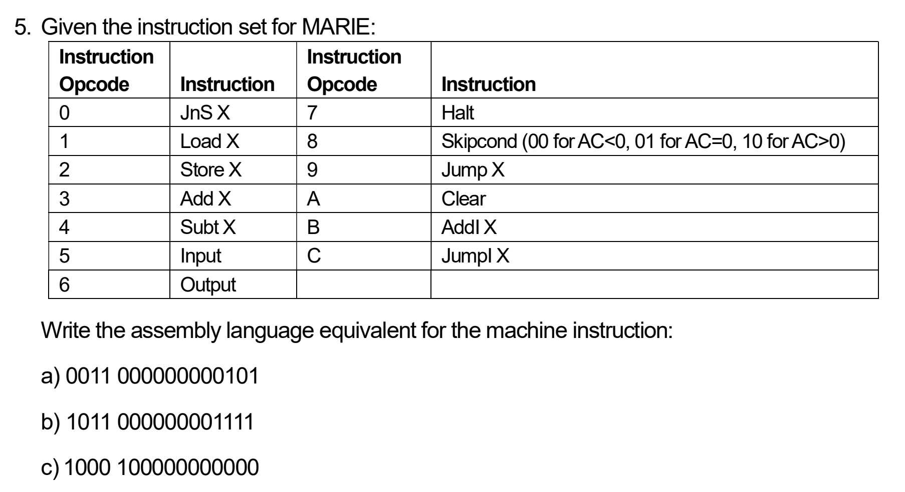

**Given MARIE instruction set:**

| Opcode | Instruction | Opcode | Instruction |
|--------|------------|--------|-------------|
| 0 | JnS X | 7 | Halt |
| 1 | Load X | 8 | Skipcond |
| 2 | Store X | 9 | Jump X |
| 3 | Add X | A | Clear |
| 4 | Subt X | B | AddI X |
| 5 | Input | C | JumpI X |
| 6 | Output | | |

**a) 0011 000000000101**
```
Opcode = 0011 = 3 (Add)
Address = 000000000101 = 5
Answer: Add 5
```

**b) 1011 000000001111**
```
Opcode = 1011 = B (AddI)
Address = 000000001111 = 15
Answer: AddI 15
```

**c) 1000 100000000000**
```
Opcode = 1000 = 8 (Skipcond)
Condition = 10 (AC > 0)
Answer: Skipcond 10 (Skip if AC > 0)
```

---

### Question 6: System Speedup

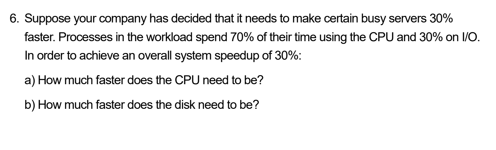

**Goal:** 30% faster, CPU=70%, I/O=30%

**a) CPU speedup needed:**
```
1.3 = 1/[0.3 + 0.7/S]
S_cpu = 1.49× (49% faster)
```

**b) Disk speedup needed:**
```
1.3 = 1/[0.7 + 0.3/S]
S_disk = 4.35× (335% faster)
```

---

### Question 6 (Alternative): TLB and Page Table

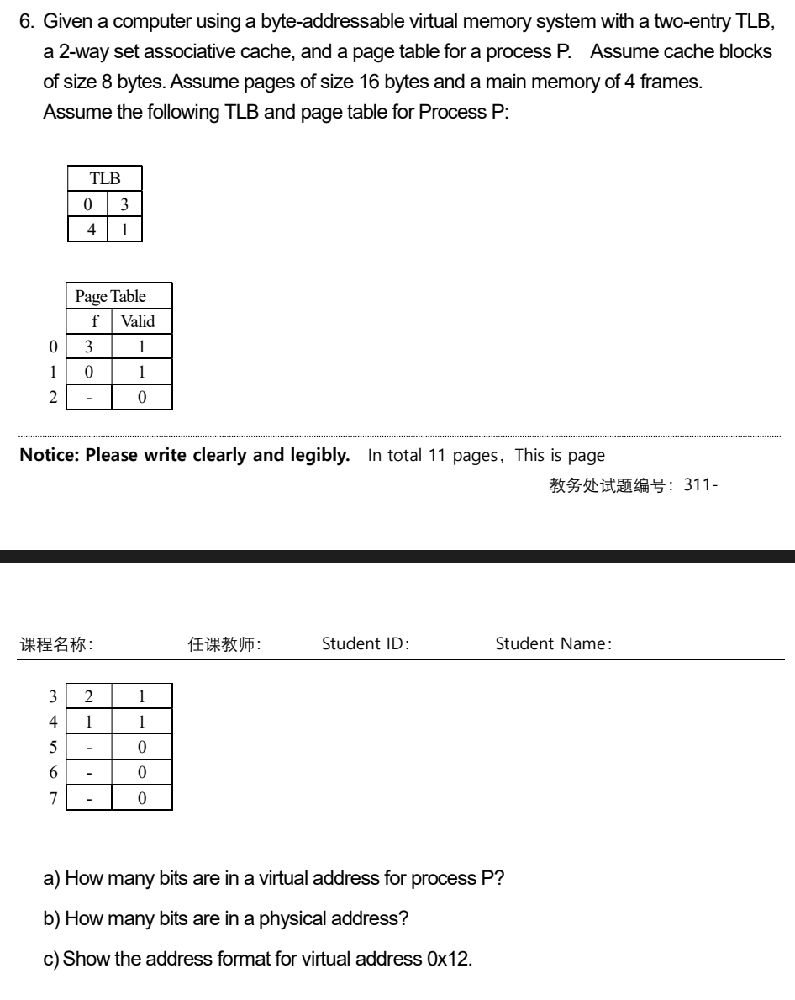

**Given:** 
- Byte-addressable virtual memory
- 2-entry TLB, 2-way set associative cache
- Cache blocks: 8 bytes
- Pages: 16 bytes
- Main memory: 4 frames

**TLB:** {0→3, 4→1}

**Page Table:**
| Page | Frame | Valid |
|------|-------|-------|
| 0 | 3 | 1 |
| 1 | 0 | 1 |
| 2 | - | 0 |
| 3 | 2 | 1 |
| 4 | 1 | 1 |
| 5 | - | 0 |
| 6 | - | 0 |
| 7 | - | 0 |

**a) Bits in virtual address:**
```
Pages = 8 → Page bits = log₂(8) = 3 bits
Page size = 16 → Offset = log₂(16) = 4 bits
Total = 3 + 4 = 7 bits
```

**b) Bits in physical address:**
```
Frames = 4 → Frame bits = log₂(4) = 2 bits
Offset = 4 bits (same as virtual)
Total = 2 + 4 = 6 bits
```

**c) Virtual address 0x12 format:**
```
0x12 = 0001 0010 binary
Page = 001 (page 1)
Offset = 0010 (offset 2)
Format: [Page(3) | Offset(4)]
```

---

<a name="calculations"></a>
## SECTION 7: CALCULATION PROBLEMS

### Problem 1: Instruction Format Design


**Given:** 256K words × 32 bits, 7 modes, 60 registers, 32-bit instruction

**a) Mode field:**
```
log₂(7) = 3 bits (need ⌈2.807⌉)
```

**b) Register field:**
```
log₂(60) = 6 bits (need ⌈5.907⌉)
```

**c) Address field:**
```
log₂(256K) = log₂(2¹⁸) = 18 bits
```

**d) Opcode field:**
```
32 - 3 - 6 - 18 = 5 bits
(Can encode 32 instructions)
```

---

### Problem 2: Direct-Mapped Cache Analysis

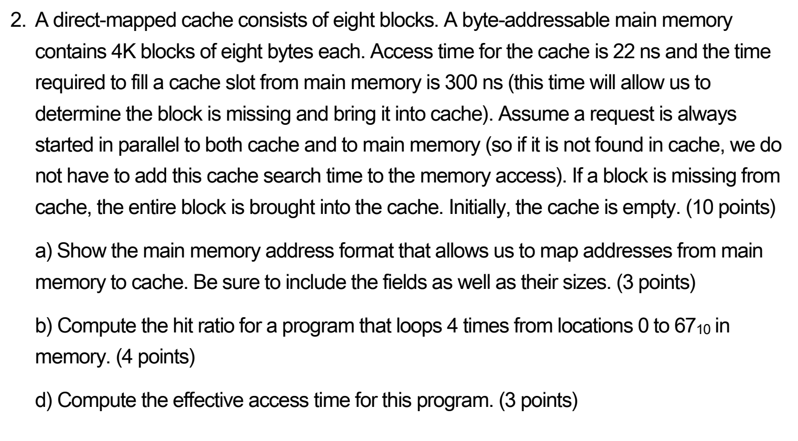

**Given:**
- Cache: 8 blocks
- Memory: 4K blocks × 8 bytes = 32K bytes
- Cache: 22 ns, Miss: 300 ns
- Loop: 4 iterations, addresses 0-67

**a) Address format:**
```
Total = 32K = 2¹⁵ bytes → 15 bits
Offset = log₂(8) = 3 bits
Block = log₂(8) = 3 bits
Tag = 15 - 3 - 3 = 9 bits

Format: [9-bit Tag | 3-bit Block | 3-bit Offset]
```

**b) Hit ratio:**
```
Addresses 0-67 = 68 bytes
Blocks needed = 68/8 = 9 blocks (0-8)

Iteration 1: 9 misses (compulsory)
Block 8 evicts block 0 (same cache location)

Iterations 2-4: 
- Block 0 miss (evicted), block 8 miss (evicted)
- 2 misses × 3 iterations = 6 misses

Total misses = 9 + 6 = 15
Total accesses = 4 × 68 = 272
Hits = 272 - 15 = 257
Hit ratio = 257/272 = 94.49%
```

**c) Effective access time:**
```
EAT = 0.9449 × 22 + 0.0551 × 300
EAT = 20.79 + 16.53 = 37.32 ns
```

---

### Problem 3: Loop Cache Performance

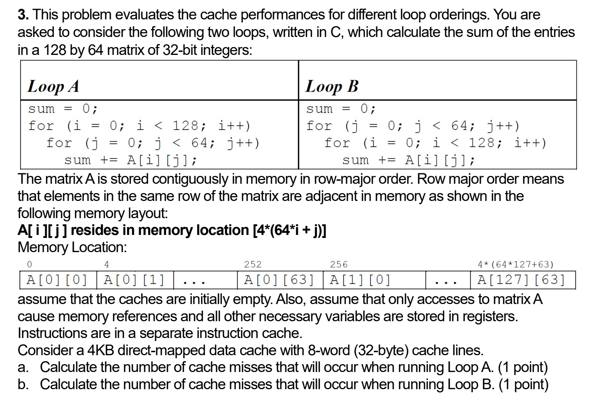

**Given:** Matrix 128×64, 4-byte integers, 4KB cache, 32-byte lines, row-major

**a) Loop A (row-by-row):**
```
Elements per line = 32/4 = 8
Total elements = 128 × 64 = 8,192
Cache lines needed = 8,192/8 = 1,024

Misses = 1,024 (one per cache line)
```

**b) Loop B (column-by-column):**
```
Stride = 64 elements = 256 bytes
Each access different cache line
No spatial locality

Misses = 8,192 (every access)
```

**Performance:** Loop A is 8× better!

---

<a name="formulas"></a>
## 📐 FORMULA REFERENCE SHEET

### Memory & Addressing Formulas

```
Address bits = log₂(Memory size)
Memory size = 2^(address bits)
Offset bits = log₂(Block size)
Words = Bytes / Bytes_per_word
Block index bits = log₂(# cache blocks)
Set index bits = log₂(# sets)
Tag bits = Address bits - Index bits - Offset bits
```

### Cache Performance Formulas

```
Hit Ratio = Hits / Total Accesses
Miss Ratio = 1 - Hit Ratio
EAT = (Hit Rate × Cache Time) + (Miss Rate × Miss Penalty)

Where:
- HR = Hit Ratio
- CT = Cache Time  
- MR = Miss Ratio
- MP = Miss Penalty
```

### Performance & Speedup Formulas

```
Speedup = Old Time / New Time
Amdahl's Law: Speedup = 1 / [(1-f) + (f/S)]

Where:
- f = fraction enhanced
- S = speedup of enhanced portion

CPI = Cycles / Instructions
MIPS = Clock MHz / CPI
```

### Disk Formulas

```
Capacity = Surfaces × Tracks × Sectors × Bytes
Rotational Latency = (60/RPM) / 2 × 1000 ms
Transfer Time = (Bytes/Sector) / Transfer Rate
Access Time = Seek + Rotation + Transfer
```

### Binary & Conversions

```
1K = 2¹⁰ = 1,024
1M = 2²⁰ = 1,048,576
1G = 2³⁰ = 1,073,741,824

1 byte = 8 bits
1 word = 4 bytes (32-bit)
1 word = 8 bytes (64-bit)
```

### Virtual Memory Formulas

```
Page offset bits = log₂(Page size)
Page number bits = Virtual address bits - Offset bits
Frame bits = log₂(Number of frames)
Physical address bits = Frame bits + Offset bits
```

---

### Quick Memory Aids

**Endianness:**
- Big endian = MSB first = readable order
- Little endian = LSB first = Intel style

**Cache Types:**
- Direct = fastest, most conflicts
- Fully Assoc = slowest, no conflicts  
- Set Assoc = balanced compromise

**Addressing Modes:**
- Immediate = value itself
- Direct = one memory access
- Indirect = two memory accesses
- Indexed = address + register
